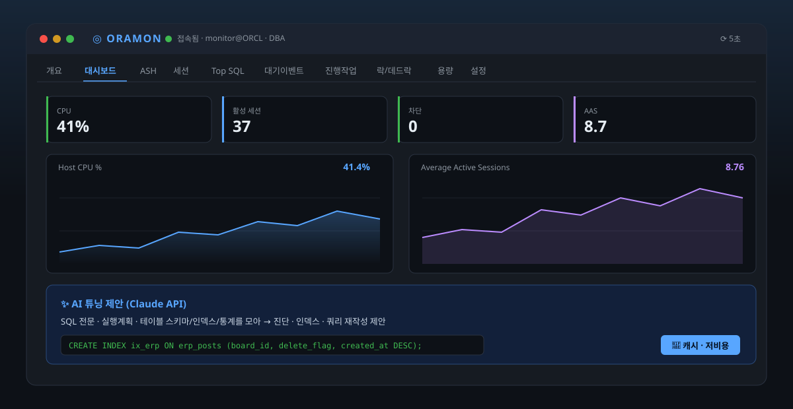

# ORAMON — Oracle 11g 실시간 모니터링


-f85149)


운영 Oracle 11g(11.2.0.4)를 팀이 **브라우저로 실시간 모니터링**하는 도구.
세션·Top SQL·대기이벤트·락/데드락·용량을 한 화면에서 보고, **자체 ASH**·**AI 튜닝 제안**·이메일 알림·세션 KILL까지 — Diagnostic Pack 유료 뷰 없이.



> 🌐 소개 페이지: **https://sangmoo.github.io/orama-agent/**

이 저장소는 두 가지 구성요소를 담고 있습니다.

| 구성 | 위치 | 용도 | 상태 |
|------|------|------|------|
| **웹 대시보드** | `web/` | 팀 공용, 브라우저 접속 | **완성 (권장)** |
| Rust TUI | `crates/` | 단일 사용자 터미널 콘솔 | 최소 스켈레톤(배너 + 세션 목록) |

> 실제 운영에서 쓰는 완성품은 **웹 대시보드**입니다. Rust TUI 는 초기 프로토타입입니다.

---

# 1. 웹 대시보드 (web/)

Node.js + Express + `oracledb`(Thick 모드) + 단일 페이지 대시보드. Oracle 11g 는 Thin 모드 미지원이라 **Instant Client(Thick) 필수**.

## 1.1 기능

| 탭 | 내용 |
|----|------|
| **개요** | 인스턴스/DB 정보 + 성능 지표 14종 + 지표별 최근 1시간 sparkline + 세션 요약 |
| **대시보드** | Grafana 스타일 실시간 차트(상태 타일 6 + 시계열 6) + **기준선 비교(어제 vs 오늘)** + 최근 CPU 스파이크 이력 |
| **ASH** | **자체 액티브 세션 히스토리** — 구간별 Top SQL/대기이벤트/세션 + AAS 추이 (Diagnostic Pack 라이선스 불필요) |
| **세션** | `v$session` 전체 목록. 활성 강조, 필터, SID 클릭 → 세션 상세(v$sesstat), SQL_ID 클릭 → 전문/실행계획/**AI 튜닝**, **KILL**(dba) |
| **Top SQL** | `v$sqlarea` 누적 Elapsed Top 30 + 실행계획(`v$sql_plan`) + **AI 튜닝 제안** |
| **대기 이벤트** | 시스템 대기 클래스 + 실시간 활성 세션 대기 + 블로킹 트리 |
| **진행 작업** | `v$session_longops` 대형작업(RMAN/인덱스/정렬) 진행률·남은시간 |
| **락/데드락** | 실시간 블로킹(Blocker KILL) + 블로킹 감지 이력(SQL_ID) + 실제 데드락 이력(alert log ORA-00060). 이력 표는 **10건씩 페이지네이션** |
| **용량** | 테이블스페이스 사용률 + 아카이브 로그 생성률(24h) + 세그먼트 Top 공간소비 |
| **설정** | 이메일 알림 on/off·수신자 관리·테스트발송 + 감지 임계치 조정 + 감사 로그 |

공통 기능
- **로그인 인증** — 부서 212003 계정(아이디=`USR_ID`)
- **표 헤더 클릭 정렬** (자동 새로고침에도 유지)
- **CSV 내보내기** (각 표, Excel 한글 호환 BOM)
- **복사 버튼** — SQL 전문·실행계획·AI 튜닝 답변 전체 복사 + 답변 내 코드블록별 개별 복사
- **자동 새로고침**(2/5/10/30초) + 마지막 탭·주기 기억(localStorage)
- 접속 상태 표시등 + 로그인 사용자·모드(readonly/DBA) 표시

## 1.2 백그라운드 수집기

서버 기동 시 주기적으로(기본 10초) DB 를 샘플링:
1. **지표 시계열** 을 SQLite 에 적재 → 대시보드 차트·기준선 비교 (재시작에도 유지)
2. **ASH 샘플** — 활성 세션을 매 tick 저장 (라이선스 프리 자체 ASH)
3. **CPU 스파이크** 감지 시 원인 세션·SQL 스냅샷 기록 + 이메일 알림
4. **블로킹** 지속 시 blocker/waiter SQL_ID 기록 + 이메일 알림
5. **테이블스페이스 포화** 감지 시 이메일 알림

## 1.3 배포 / 실행

**사전 준비**
- Node.js 18+ (테스트: v22)
- Oracle Instant Client (경로를 `.env` `ORACLE_CLIENT_PATH` 에 지정, 예: `C:\oracle\instantclient_23_7`)

```bash
cd web
npm install
copy .env.example .env      # (Windows)  또는  cp .env.example .env
#  .env 편집: DB 접속정보 입력
npm start
```

브라우저에서 **http://localhost:3900** 접속.
같은 네트워크의 팀원은 **http://<서버IP>:3900** 으로 접속.

> 상시 구동은 `pm2 start server.js --name oramon` 또는 Windows 서비스(nssm) 등록을 권장.

## 1.4 .env 설정 (web/.env)

```ini
# Oracle Instant Client (Thick 모드 필수)
ORACLE_CLIENT_PATH=C:\oracle\instantclient_23_7

# DB 접속 (Oracle 11g, SID 방식)
DB_HOST=192.168.0.10
DB_PORT=1521
DB_SID=ORCL
DB_USER=monitor_user
DB_PASSWORD='p@ss#w0rd$'     # ★ #,$ 등 특수문자는 반드시 작은따옴표 (dotenv 가 # 를 주석 처리함)

POOL_MIN=2
POOL_MAX=8
PORT=3900
SHOW_BACKGROUND=false        # true 면 백그라운드 프로세스 세션도 표시
ORAMON_MODE=readonly         # readonly(조회만) | dba(세션 KILL 허용, ALTER SYSTEM 권한 필요)

# 수집기 / 임계치 (설정 탭에서 런타임 조정 가능)
COLLECT_INTERVAL_MS=10000
HISTORY_POINTS=1080
CPU_SPIKE_PCT=85
BLOCK_ALERT_SEC=30
TS_ALERT_PCT=90
RETAIN_DAYS=7                # ASH·알림로그·튜닝캐시 등 고빈도 데이터 보관(일)
LOG_RETAIN_DAYS=30          # 감사 로그·블로킹 감지 이력·CPU 스파이크·데드락 이력 보관(일)

# 로그인 인증
AUTH_ENABLED=true            # false 면 인증 없이 열림(사내 폐쇄망 등)
AUTH_IDLE_MIN=480            # 무활동 세션 만료(분)

# 이메일 알림 (SMTP) — 수신자 등록은 웹 UI 설정 탭에서
ALERT_ENABLED=false
SMTP_HOST=
SMTP_PORT=587
SMTP_SECURE=false            # 465 포트면 true
SMTP_USER=
SMTP_PASS=
SMTP_FROM=oramon@yourcompany.com
```

> **비밀번호 따옴표 주의**: node `dotenv` 는 따옴표 없는 값의 `#` 를 주석으로 잘라냅니다. `p@ss#w0rd$` 를 그냥 두면 `p@ss` 로 읽혀 ORA-01017 이 납니다. **작은따옴표 필수.**

## 1.5 로그인 인증

- `AUTH_ENABLED=true`(기본)면 로그인 필요. 계정은 **`T_USR`/`T_EMP` 부서 `212003`, `USE_YN='Y'`** 사용자, 아이디는 `USR_ID`.
- 비밀번호는 **SQL 내에서 `CRYPTO_DECRYPT(U.PWD)` 로 bind 비교** → 앱이 복호화된 비밀번호를 받거나 로그에 남기지 않음.
- 세션은 HttpOnly 쿠키, `AUTH_IDLE_MIN`(기본 8시간) 무활동 시 만료. 서버 재시작 시 재로그인.
- **감사 로그**: 로그인·KILL·설정변경을 누가 했는지 기록 → 설정 탭에서 조회.

## 1.6 이메일 알림

1. `.env` 에 SMTP 정보(`SMTP_HOST` 등) 입력 + `ALERT_ENABLED=true` (또는 설정 탭 토글)
2. 설정 탭에서 수신자 이메일 등록 → **테스트 메일 발송**으로 확인
3. CPU 스파이크·블로킹·TS 포화 시 등록된 수신자에게 **원인 SQL_ID 와 전문 포함** 메일 발송

## 1.7 세션 KILL (개입)

- 기본은 `readonly` 라 KILL 버튼이 숨겨짐. `ORAMON_MODE=dba` + `ALTER SYSTEM` 권한이 있어야 동작.
- 세션 행/블로킹 표의 KILL 버튼 → 확인 → `ALTER SYSTEM KILL SESSION`. sid/serial 정수 검증(인젝션 차단), 감사 로그 기록.

## 1.8 운영 안정성 / 보안

- **DB 재접속 복원력**: 웹서버가 먼저 뜨고 Oracle 은 재시도 루프로 접속. 리스너 지연·순단에도 스스로 회복(`poolPingInterval`).
- **HTTPS 권장**: 로그인·KILL·SMTP 비번이 평문으로 오가지 않도록 리버스 프록시(TLS) 앞단 배치 권장.
- **영구 데이터**: `web/data/oramon.db`(SQLite, 지표·ASH·이벤트·수신자·감사로그). `.gitignore` 처리됨.
- **데이터 보관/자동 삭제**: 수집기가 매시간 오래된 데이터를 정리합니다. **감사 로그·블로킹 감지 이력·CPU 스파이크·데드락 이력은 `LOG_RETAIN_DAYS`(기본 30일)** 보관 후 삭제되고, ASH·튜닝 캐시 등은 `RETAIN_DAYS`(기본 7일)로 관리됩니다. 데드락은 alert log에서 최근 `LOG_RETAIN_DAYS`일만 표시합니다.
- **이력 페이지네이션**: 감사 로그·블로킹 감지 이력·데드락 이력은 **10건씩 페이지**로 나눠 보며(이전/다음), CSV 내보내기는 전체 건을 대상으로 합니다.

## 1.9 AI 튜닝 제안 (Claude API)

SQL_ID 모달의 **✨ AI 튜닝** 탭에서 **튜닝 제안 생성**을 누르면, 서버가 다음을 모아 Claude 에 보내고 한국어 튜닝 리포트를 받습니다:
- SQL 전문 + 실행계획(`v$sql_plan`) + 실행 통계
- 실행계획에 등장하는 **실제 테이블의 컬럼·인덱스·통계**(dba_/all_ 뷰)

리포트는 **핵심 진단 → 인덱스 제안(CREATE INDEX) → 쿼리 재작성 → 기타/주의** 순으로 나옵니다.
Top SQL·세션·블로킹 표의 SQL_ID 모두 이 모달로 열려 한 곳에서 사용합니다.

**스트리밍 응답(SSE)** — 답변을 기다리는 동안 UX를 위해 진행 상태를 실시간 표시합니다:
- 분석 시작 시 **🧠 "스키마·실행계획 분석 중…"** 인디케이터
- 이후 답변 토큰이 **타이핑되듯 실시간으로 흐르고**(Server-Sent Events), 완료되면 마크다운(표·코드블록)으로 렌더링
- 캐시 적중 시에는 즉시 표시(스트리밍 생략)

**복사** — 답변 우상단 **📋 복사**로 전체 리포트(원본 마크다운)를, 각 코드블록의 **복사** 버튼으로 `CREATE INDEX`·재작성 SQL 등을 개별 복사할 수 있습니다.

**비용 가드레일** — 실제 토큰을 쓰므로 안전장치를 내장했습니다:
- **결과 캐시**: 같은 SQL_ID는 `TUNE_CACHE_TTL_MIN`(기본 24시간) 동안 SQLite 캐시에서 즉시 반환(토큰 0). 최신 분석이 필요하면 **🔄 새로 생성** 버튼.
- **쿨다운/일일 한도**: 사용자별 신규 호출 `TUNE_COOLDOWN_SEC`(기본 15초) 간격, `TUNE_DAILY_LIMIT`(기본 30회/일, **`.env`에서 조정**).
- **한도 소진 UI**: 당일 사용량이 한도 이상(`usedToday >= TUNE_DAILY_LIMIT`)이면 **튜닝 제안 생성 버튼이 자동 비활성화**되고 **"⛔ 당일 호출 횟수를 다 사용하였습니다 (오늘 N/N회)"** 안내가 표시됩니다. 메타 줄에도 `(한도 소진)` 표기. 이미 만들어진 제안은 캐시로 계속 열람됩니다.
- **한도 영구 유지**: 호출 카운트는 `data/oramon.db`(SQLite) `tune_calls` 테이블에 기록되어 **서버 재시작·재배포에도 초기화되지 않습니다**. 매일 자정(로컬 시각) 기준으로 그날 호출만 카운트합니다. (배포 시 `data/` 디렉터리를 보존하세요.)

설정(`.env`):
```ini
ANTHROPIC_API_KEY=sk-ant-...   # 서버에서만 사용, 브라우저로 나가지 않음
ANTHROPIC_MODEL=claude-opus-5
ANTHROPIC_EFFORT=medium        # low | medium | high | xhigh | max
TUNE_CACHE_TTL_MIN=1440        # 캐시 유지(분)
TUNE_COOLDOWN_SEC=15           # 신규 호출 쿨다운(초)
TUNE_DAILY_LIMIT=30            # 사용자별 1일 한도
```
> API 키가 없으면 탭에서 "미설정" 안내만 표시되고 다른 기능은 정상 동작합니다. 요청은 로그인 필요하며 감사 로그에 남습니다.

## 1.10 Grafana 연동 (선택)

앱 내장 대시보드로 충분하지만, 진짜 Grafana 를 쓰려면 Prometheus 노출 엔드포인트 사용:
```
GET /metrics   →  oramon_host_cpu_pct, oramon_avg_active_sessions, oramon_sessions_active/blocked/total, ...
```
Prometheus 가 scrape → Grafana 데이터소스로 연결. (`/metrics` 는 인증 불필요)

## 1.11 라이선스 주의

- **ASH 는 `v$active_session_history`(Diagnostic Pack 유료) 를 쓰지 않고** 수집기가 직접 샘플링한 자체 구현입니다.
- `v$sql_monitor`, `dba_hist_*`(AWR) 등 Diagnostic/Tuning Pack 뷰는 사용하지 않습니다.

> API 엔드포인트 전체 목록·상세는 [web/README.md](web/README.md) 참고.

---

# 2. Rust TUI (crates/)

초기 프로토타입. 터미널 전체화면(ratatui)으로 배너 + 세션 목록을 보여줍니다.

## 2.1 사전 준비

- Rust 1.75+ (`rustup install stable`)
- Oracle Instant Client 또는 정식 클라이언트가 **PATH 에 있어야** 함(ODPI-C 가 `oci.dll` 을 PATH 에서 로드)
  - Windows: Instant Client 폴더를 시스템 PATH 에 추가
  - Linux/macOS: `LD_LIBRARY_PATH` / `DYLD_LIBRARY_PATH`

## 2.2 설정 (루트 .env)

웹과 **별개 스키마**(`ORAMON_*`). SID 접속이라 전체 디스크립터 사용:

```ini
ORAMON_DSN=(DESCRIPTION=(ADDRESS=(PROTOCOL=TCP)(HOST=192.168.0.10)(PORT=1521))(CONNECT_DATA=(SID=ORCL)))
ORAMON_USER=monitor_user
ORAMON_PASSWORD='p@ss#w0rd$'
ORAMON_AS_SYSDBA=false        # SYSDBA 는 세션 풀에서 미지원
ORAMON_PROFILE=ORCL
ORAMON_POOL_MIN=2
ORAMON_POOL_MAX=8
ORAMON_MODE=readonly
```

## 2.3 빌드 / 실행

```bash
cargo run -p oramon-tui
# 릴리스 빌드:
cargo build --release && ./target/release/oramon
```

종료: `q` 또는 `Esc`

## 2.4 참고 (11g 호환)

- 세션 쿼리는 11g 호환을 위해 `FETCH FIRST` 대신 `ROWNUM` 사용.
- `chrono` 타입 바인딩을 위해 `oracle` 크레이트 `chrono` feature 활성화됨.

---

# 3. 디렉토리 구조

```
oramon/
├── README.md              ← 이 문서
├── LICENSE                ← Apache-2.0
├── .gitignore             ← .env · node_modules · data · target 제외
├── .env                   ← Rust TUI 용 (gitignore, 커밋 안 됨)
├── Cargo.toml             ← Rust workspace
├── docs/                  ← GitHub Pages (index.html 랜딩 + preview.svg)
├── crates/                ← Rust TUI (oramon-core / -oracle / -collector / -tui)
└── web/                   ← 웹 대시보드 (실제 완성품)
    ├── server.js          Express + REST API + 인증
    ├── db.js              oracledb 풀(Thick, SID, 재접속 복원)
    ├── queries.js         v$ 뷰 SQL 모음
    ├── collector.js       백그라운드 수집(지표·ASH·스파이크·블로킹·알림)
    ├── store.js           SQLite 영구저장 (node:sqlite)
    ├── mailer.js          SMTP 이메일 알림
    ├── auth.js            로그인/세션
    ├── advisor.js         AI 튜닝 제안 (Claude API)
    ├── .env / .env.example
    ├── data/oramon.db     SQLite (gitignore)
    └── public/            index.html · app.js · style.css
```

---

# 4. 배포 · 라이선스

## GitHub Pages (홍보 페이지)
`docs/index.html` 이 소개용 랜딩 페이지입니다. GitHub 저장소 **Settings → Pages → Source: main 브랜치 `/docs` 폴더** 로 지정하면 `https://sangmoo.github.io/orama-agent/` 로 공개됩니다.

## 보안 주의
- **`.env` 는 절대 커밋하지 마세요** (`.gitignore` 처리됨). DB 비밀번호·`ANTHROPIC_API_KEY` 가 들어있습니다.
- 저장소를 공개하기 전, 노출된 적 있는 **API 키/DB 비밀번호는 재발급(rotate)** 을 권장합니다.
- `web/data/` 의 SQLite/로그(감사·스냅샷)에는 세션·SQL 정보가 담기므로 커밋 대상에서 제외됩니다.

## 라이선스
[Apache License 2.0](LICENSE) — 특허 사용 허가 조항을 포함하며 상용·사내 배포에 적합합니다.
